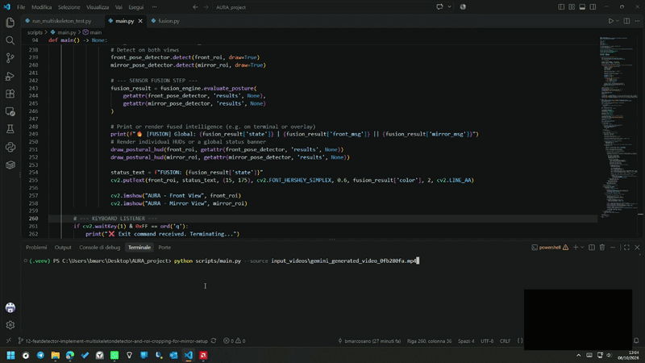

# AURA (Augmented User Real-time Assistant)

[](https://www.python.org/downloads/)
[](https://developers.google.com/mediapipe)
[](https://github.com/features/actions)
[](https://github.com/astral-sh/ruff)
[](https://docs.pytest.org/en/stable/)

> **An Explainable "Magic Mirror" for 360° Postural Tracking and Multimodal Biofeedback**

<p align="center">
  
</p>

---

## 1. Overview and Academic Objective
**AURA** is an interactive kiosk prototype ("Magic Mirror") designed for real-time postural correction and fitness coaching. Developed using modern software engineering and MLOps practices, the project bridges the gap between complex computer vision algorithms and real-time edge reactivity, ensuring a rigorous, transparent, and user-friendly framework.

## 2. Core Architecture & Technical Requirements
Unlike heavy, proprietary black-box systems, AURA is engineered following an **edge-friendly** philosophy:
- **Hardware Target:** Designed to run smoothly on standard Consumer Off-The-Shelf (COTS) hardware (**CPU-based** execution without requiring dedicated GPU accelerators).
- **Performance Targets:** Maintains $\ge 30$ FPS with an end-to-end processing latency of $<35$ ms per frame.
- **Core Stack:** Python $\ge 3.10$, OpenCV, MediaPipe Pose (v0.10.14), FastDTW (Dynamic Time Warping), and NumPy.

## 3. Flexible Optical Setup (Single-Camera vs. 45° Mirror Mode)
To solve the multi-view occlusion problem without invasive multi-camera setups or heavy 3D mesh recovery networks, AURA supports a dual optical configuration:
- **Standard Mode:** Direct front-facing webcam view for baseline exercises.
- **Advanced "Magic Mirror" Mode (45° Side Mirror Setup):** Pairs a single front-facing webcam with a side mirror. A single video frame simultaneously captures both the direct (frontal) and reflected (lateral) views, leveraging the physics of light to achieve complete **360° biomechanical analysis** with minimal CPU overhead via dynamic Region-of-Interest (ROI) cropping.

## 4. User Experience (HCI & UX)
- **The Clean Mirror:** The display functions primarily as a clean mirror, allowing users to focus entirely on their own physical execution without distracting moving overlays.
- **The Vigilant Virtual Coach (NPC):** A calm, stationary interface manages session states (Standby $\rightarrow$ Exercise Selection $\rightarrow$ Execution $\rightarrow$ Rest Timer) and intervenes through multimodal feedback only when biomechanical deviations occur.

## 5. Algorithmic Pipeline
1. **Perception (`detector.py` / `multi_detector.py`):** Captures frames, handles optical ROI slicing, and extracts lightweight 3D skeletal joint coordinates.
2. **Sensor Fusion (`fusion.py`):** Evaluates multi-view alignment, combining front symmetry with profile spine metrics with safety-first override logic.
3. **Geometric Engine (`geometry.py`):** Computes instantaneous angular metrics (e.g., knee flexion, spine inclination) using robust NumPy vector operations.
4. **Temporal Alignment (`dtw_engine.py`):** Utilizes Dynamic Time Warping to compare user execution time-series against a reference sequence handling speed and rhythm variations.
5. **Explainable AI (`analyzer.py`):** Evaluates sub-millisecond geometric threshold rules to trigger localized visual overlays and targeted feedback.

---

## 6. Project Structure

```text
AURA_project/
├── .github/
│   └── workflows/
│       └── ci.yml                  # GitHub Actions CI Pipeline
├── docs/
│   └── figures/
│       └── AURA_Fusion.gif         # Demo Assets
├── scripts/
│   ├── main.py                     # Main application entry point
│   ├── run_multiskeleton_test.py   # Utility for testing mirror mode
│   └── run_webcam.py               # Utility for basic webcam testing
├── src/
│   └── aura/                       # Core Package
│       ├── analyzer.py             # Rule-based logic and feedback
│       ├── calibrator.py           # Camera/Mirror calibration
│       ├── detector.py             # Single-view MediaPipe Wrapper
│       ├── fusion.py               # Dual-View Sensor Fusion Engine
│       ├── geometry.py             # Math/Vector operations
│       └── multi_detector.py       # ROI Slicing and Dual-Detection
├── tests/                          # Pytest Suite
│   ├── assets/
│   ├── test_analyzer.py
│   ├── test_detector.py
│   ├── test_fusion.py
│   ├── test_geometry.py
│   ├── test_multi_detector.py
│   ├── test_state_machine.py
│   └── test_sync_analyzer.py
├── .pre-commit-config.yaml         # Git Hooks configuration (Ruff)
├── pyproject.toml                  # Project metadata and dependencies
├── README.md
└── requirements.txt                # Pointer for CI dependency resolution
```

---

## 7. Getting Started & Quick Start

### Prerequisites
- Python 3.10 or higher
- Git
- A standard Webcam (for live inference)

### Installation Guide

**1. Clone the repository:**
```bash
git clone [https://github.com/bmarcosano/AURA_project.git](https://github.com/bmarcosano/AURA_project.git)
cd AURA_project
```

**2. Set up a virtual environment (Recommended):**
```bash
# Windows
python -m venv .venv
.venv\Scripts\activate

# Linux / macOS
python3 -m venv .venv
source .venv/bin/activate
```

**3. Install dependencies:**
The project uses `pyproject.toml` to handle dependencies (including pinning MediaPipe to `0.10.14` for compatibility). Install the package in editable mode:
```bash
python -m pip install --upgrade pip
pip install -e .
```
*(Alternatively, you can run `pip install -r requirements.txt`)*

**4. Install Quality Hooks (pre-commit):**
To automatically format and lint your code before every commit using Ruff:
```bash
pip install pre-commit ruff
pre-commit install
```

---

## 8. Running the System

- **Run the Main Application with webcam(Full Pipeline):**
  ```bash
  python scripts/main.py
  ```

- **Run the Main Application with a source video**
  ```bash
  python scripts/main.py --source <video_relative_path>
  ```

### Quality Assurance (Testing & Linting)
- **Run the Unit Test Suite (Pytest):**
  ```bash
  pytest tests/ -v
  ```
- **Run the Linter & Formatter (Ruff):**
  ```bash
  ruff check .
  ruff format .
  ```